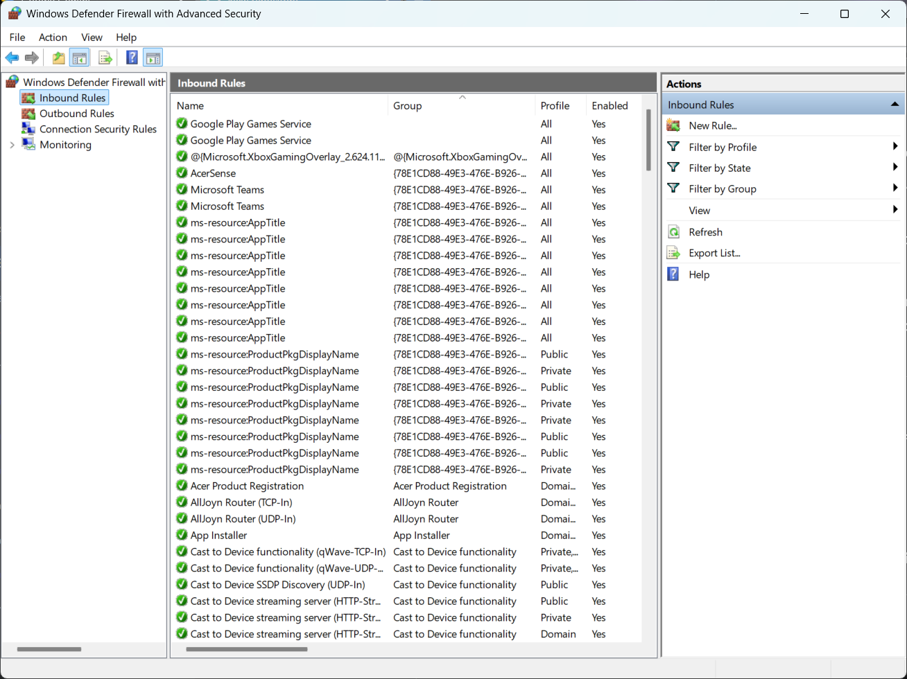
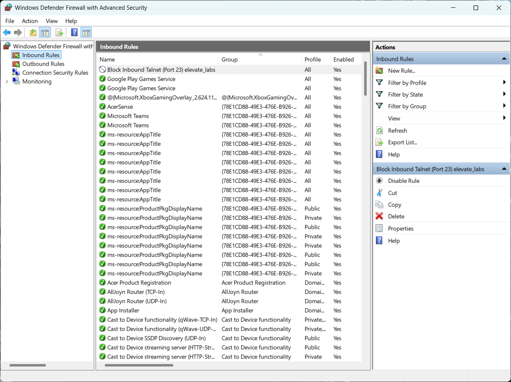
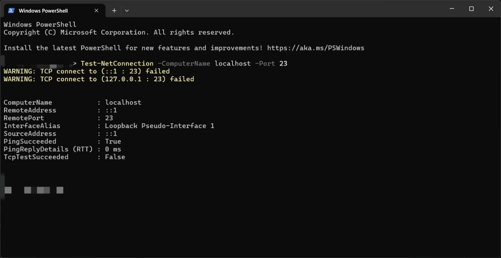

# Basic Firewall Configuration
Demonstrating basic firewall management by configuring and testing rules on Windows Firewall.

## Objective
The objective of this project is to configure and test basic firewall rules to allow or block network traffic, demonstrating a fundamental understanding of firewall management.

## Tool Used
* **Windows Defender Firewall with Advanced Security:** The graphical user interface used to manage firewall rules on Windows.

## Process Followed
This section documents the steps taken to configure and test the firewall.

1.  The "Windows Defender Firewall with Advanced Security" interface was opened to view the existing inbound rules.
2.  A new inbound rule was created to specifically **block** all incoming traffic on **TCP port 23 (Telnet)**.
3.  The `Test-NetConnection` command in PowerShell was used to test the new rule, which successfully confirmed that connections to port 23 were being blocked.
4.  Finally, the test rule was deleted to restore the firewall to its original state.

## How a Firewall Filters Traffic
A firewall acts as a digital barrier for a computer network. It inspects all data packets (both incoming and outgoing) and decides whether to **allow** them to pass through or **block** them based on a predefined set of security rules. These rules can be based on criteria like port numbers, protocols (TCP/UDP), and source/destination IP addresses. By blocking potentially harmful or unwanted traffic, a firewall serves as a critical first line of defense against network-based threats.

## Proof of Work: Screenshots
Below are the screenshots documenting the process of creating, testing, and removing the firewall rule.

### 1. Initial State of Firewall Rules
*(This screenshot shows the list of inbound rules before any changes were made.)*

### 2. New "Block Telnet" Rule Created
*(This screenshot shows the new rule successfully added to the top of the inbound rules list.)*

### 3. Testing the Firewall Rule
*(This screenshot shows the PowerShell output where the connection test to port 23 failed, proving the rule works.)*

---
## Key Concepts Encountered
This project involves several important cybersecurity concepts:
* The function of a firewall.
* The difference between stateful and stateless firewalls.
* The definition of inbound and outbound rules.
* Why insecure ports like Telnet (port 23) should be blocked.
* How a firewall improves overall network security.
